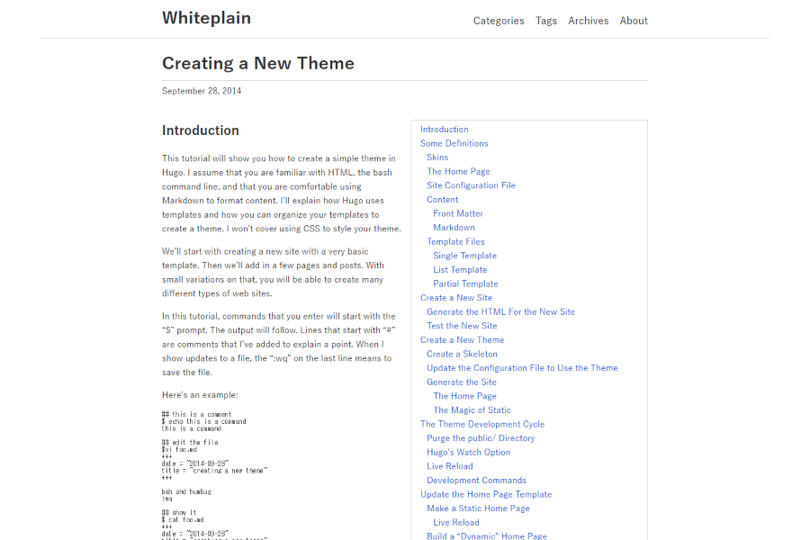

# Whiteplain

[](https://circleci.com/gh/taikii/whiteplain)

This is simple and functional [Hugo](https://gohugo.io/) theme.



## Installation

```
$ git clone https://github.com/taikii/whiteplain.git themes/whiteplain
```
Or
```
$ git submodule add https://github.com/taikii/whiteplain.git themes/whiteplain
```

## Usage

### Configration

```toml
baseurl = "https://example.com/"
title = "Whiteplain"
theme = "whiteplain"
languageCode = "en"
# Disqus shortname
disqusShortname = "Shortname"
# google analytics tracking id
googleAnalytics = "Toracking ID"

# Copyright notice. This is displayer in the footer.
copyright = "&copy; Copyright 2017 Your name"

[params]
  # Date format
  #dateFormat = "January 2, 2006"

# This is displayer in About page.
[params.author]
  name = "Your name"
  # Gravatar or Abatar image
  gravatar = "Gravatar email or MD5 Hash"
  #avatar = "/path/to/avatar"

  twitter = "Twitter username"
  facebook = "Facebook username"
  googleplus = "Googleplus username"
  instagram = "Instagram username"
  tumblr = "Tumblr username"
  flickr = "Flickr username"
  reddit = "Reddit username"
  linkedin = "Linkedin username"
  slideshare = "Slideshare username"
  github = "Github username"
  gitlab = "Gitlab username"
  bitbucket = "Bitbucket username"
  stackoverflow = "Stackoverflow username"
  jsfiddle = "Jsfiddle username"
  codepen = "Codepen username"
  deviantart = "Deviantart username"
  behance = "Behance username"
  dribbble = "Dribbble username"
  wordpress = "Wordpress username"
  medium = "Medium username"
  foursquare = "Foursquare username"
  xing = "Xing username"
  quora = "Quora username"
  youtube = "Youtube username"
  vimeo = "Vimeo username"
  whatsapp = "Whatsapp username"
  skype = "Skype username"
  snapchat = "Snapchat username"
  pinterest = "Pinterest username"
  telegram = "Telegram username"
  vine = "Vine username"
  email = "Your email"

[taxonomies]
  category = "categories"
  tag = "tags"
  series = "series"

# Header Menu
[[menu.main]]
  name = "Categories"
  identifier = "categories"
  url = "/categories/"
  weight = 1
[[menu.main]]
  name = "Tags"
  identifier = "tags"
  url = "/tags/"
  weight = 2
[[menu.main]]
  name = "Archives"
  identifier = "archives"
  url = "/archives/"
  weight = 3
[[menu.main]]
  name = "About"
  identifier = "about"
  url = "/about/"
  weight = 4

# Footer Menu
[[menu.footer]]
  name = "About"
  weight = 1
  identifier = "about"
  url = "/about/"
```

### Archives page
The Archive page will be displayed, if you create `content/archives/_index.html`.
The file can be 0 bytes.
```
Hugo site direcctory
└── content
    └── archives
        └── _index.md
```

### About page
The author information is displayed on the About page. You should create an About page in `content/about/_index.md`.
```
Your site direcctory
└── content
    └── about
        └── _index.md
```

### Customize Stylesheet and Javascript
You can customize Stylesheet and Javascript. When you create `static/css/custom.css` `static/js/custom.js`, it will be loaded automatically.

Default Syntax highlighter style is `monokai`. If you want to change the style, create `static/css/syntax.css`. See [Hugo Syntax Highlighting](https://gohugo.io/content-management/syntax-highlighting/) about Syntax highlighting.
```
Your site direcctory
└── static
    ├── css
    │   ├── custom.css
    │   └── syntax.css
    └── js
        └── custom.js
```

### Customize Share Buttons
1. Copy `themes/whiteplain/layout/partials/share.html` to `layout/partcials/share.html`.
2. Customize `layout/partcials/share.html`.
```
Your site direcctory
├── layout
│   └── partials
│       └── share.html
└── themes
    └── whiteplain
        └── layout
            └── partials
                └── share.html
```

### Customize Author SNS Icons
1. Copy `themes/whiteplain/layout/partials/social.html` to `layout/partcials/sorcial.html`.
2. Customize `layout/partcials/social.html`.
```
Your site direcctory
├── layout
│   └── partials
│       └── social.html
└── themes
    └── whiteplain
        └── layout
            └── partials
                └── social.html
```

## Icons
This theme using [Font Awesome](https://fontawesome.com/).

## License
[MIT](LICENSE)
